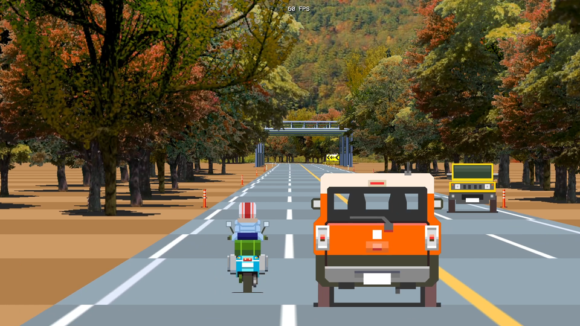
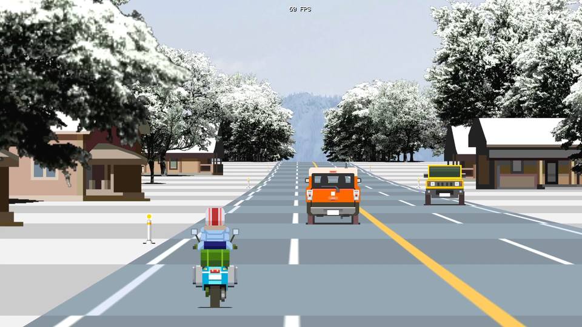

ssp3droadgl
===========

Screensaver for Windows that draws pseudo 3D roads, implemented in C++ and OpenGL.

Issue. Does not work on some PCs. Cause unknown. It will not work if the desktop resolution is 1920x1200, but will work if the desktop resolution is 1920x1080. Why?

Screenshots
-----------


[01summer.png](./screensots/01summer.png)


[02autumn.png](./screensots/02autumn.png)


[03winter.png](./screensots/03winter.png)


[04night.png](./screensots/04night.png)

[Movie (YouTube)](https://youtu.be/yN2tBqr5mf0?si=fpiq0YwlXMFVETTD)

Install
-------

Copy 1 files to Windows system folder.

* ssp3droadgl.scr

```
Windows 64bit : C:\Windows\SysWOW64\
Windows 32bit : C:\Windows\System32\
```

The screen saver name is "P3D Road GL".

The settings are saved in an ini file.

```
%APPDATA%\ssp3droadgl\ssp3droadgl.ini

Windows10 : C:\Users\(USERNAME)\AppData\Roaming\ssp3droadgl\ssp3droadgl.ini
```

### Extra

ssp3droadglfw.exe is a demonstration program that draws almost as well as this screen saver. Using GLFW.

* 1,2,3,4 key : Draw on/off. tree, slope, BG, beam
* F key : Change framerate. 60, 30, 20 FPS.

Uninstall
---------

Delete files.

```
C:\Windows\SysWOW64\ssp3droadgl.scr
(or C:\Windows\System32\ssp3droadgl.scr)

%APPDATA%\ssp3droadgl\ssp3droadgl.ini
%APPDATA%\ssp3droadgl
```

Build Requirement / Environment
-------------------------------

### Build ssp3droadgl.scr

* Windows10 x64 22H2
* MinGW (g++ 6.3.0)
* windres 2.28 (in binutils package)
* ld 2.28 or objcopy 2.28 (in binutils package)

```
cd src
make clean
make
```

### Build ssp3droadglfw.exe 

#### Windows10 x64 22H2

* MSYS2 (g++ 13.2.0)
* ld 2.42
* GLFW 3.4 (mingw-w64-i686-glfw or mingw-w64-x86_64-glfw)

```
cd src
make -f Makefile.glfw clean
make -f Makefile.glfw
```

#### Ubuntu Linux 22.04 LTS / 20.04 LTS

* g++ 11.4.0 / g++ 9.4.0
* ld 2.38 / 2.34
* libglfw3-dev 3.3.6-1 / 3.3.2-1
 
```
cd src
make -f Makefile.glfw clean
make -f Makefile.glfw
./ssp3droadglfw
```

Author
------

[mieki256](https://github.com/mieki256)

License
-------

mieki256が書いた部分(render.cpp、sprites.png)は、CC0 / Public Domain 扱いということで…。

Reference
---------

[How to Scr: Writing an OpenGL Screensaver for Windows](http://www.cityintherain.com/howtoscr.html)

Resource
--------

### Fonts

* [ProFont for Windows, for Macintosh, for Linux](https://tobiasjung.name/profont/)
* [shinonome font family](http://openlab.ring.gr.jp/efont/shinonome/)
* [Terminus Font Home Page](https://terminus-font.sourceforge.net/)
* [pet2015 font](http://blawat2015.no-ip.com/~mieki256/diary/202310301.html#202310301)

### Library

* [nothings/stb: stb single-file public domain libraries for C/C++](https://github.com/nothings/stb)

### Background images

* [Landscape Spring Summer - Free photo on Pixabay - Pixabay](https://pixabay.com/photos/landscape-spring-summer-england-215830/)
* [Fall Aerial Free Stock CC0 Photo - StockSnap.io](https://stocksnap.io/photo/fall-aerial-ZHYBXNFOB4)
* [Valley Field Landscape - Free photo on Pixabay - Pixabay](https://pixabay.com/photos/valley-field-landscape-meadow-63564/)
* [Snow covered mountain during daytime photo – Free Hirzel Image on Unsplash](https://unsplash.com/photos/snow-covered-mountain-during-daytime-lnkaoonau-c)
* [Luberon Gordes Night - Free photo on Pixabay - Pixabay](https://pixabay.com/photos/luberon-gordes-night-france-city-7084098/)

